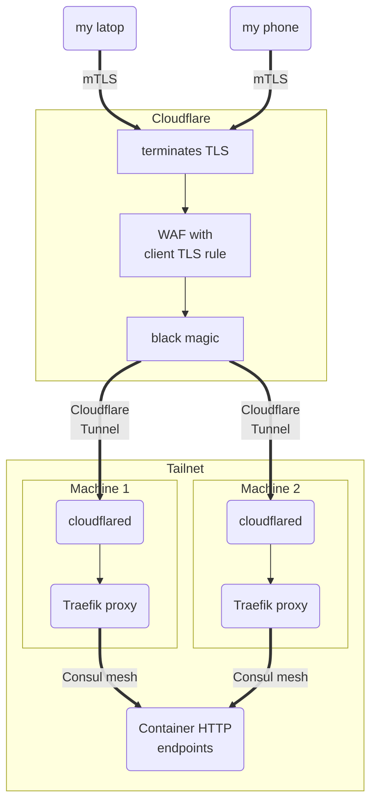

_28/07/2026 - #mtls #pki #vpnless #cloudflaretunnel #novpn_

> 🔧 This post talks about my self-hosted cluster, [you can find an overview of it here](/projects/selfhosted-homelab).

## The problem

I am generally pretty happy with my homelab now, to the point I tinker with it less and less. I am particularly
satisfied with having chosen Tailscale as 'thing connector' - I am very impressed at how it does direct connections
between
any number of nodes and services (as opposed to a hub-and-spoke VPN).

Still, a VPN is a VPN, and Tailscale has several of the shortcomings of VPNs:

- I am wary of keepalives. Unlike with WireGuard, I do not have full control of what Tailscale does when I am
  not using it, and I am afraid of it draining my phone battery if I keep it always on. Conversely, I also do not want
  to be disconnecting and re-connecting manually every time I access anything on my homelab.

- For client traffic (like my phone or my laptop) installing Tailscale is essentially installing a backdoor. This,
  understandably, is the
  main reason my employer would prefer I do not install any VPN clients on my work laptop.

- When I want to let others access my self-hosted apps, installing VPNs on _their_ devices is poor user experience.
  And it is also a back-door!

So, to access some of my self-hosted apps, I must do without installing Tailscale on client devices (laptops,
smartphones...).

What alternatives do I have?

There are always other VPNs, like Cloudflare's. I am not familiar with every single VPN and protocol under the sun, but
I suspect they all have at least one of the shortcomings Tailscale has, due to how VPNs fundamentally work.

So if we can't use private networking, the only other way forward is **exposing my services over the public internet.**
I already do some of this to an extent (see [this older blog post](/blog/ociPublicLoadBalancer)) but this is scary to me.
I would rather not expose the more sensitive services,
like Papra (documents) or Immich (photos).

Then I got inspiration from Monzo, and how they moved away from VPNs completely for internal tooling thanks to mTLS, and
I decided to attempt the same.

## The solution: mTLS it all!

We already use TLS every time we use an HTTPS website -- hopefully like the one where you are reading this.

[Oversimplifying](https://en.wikipedia.org/wiki/Transport_Layer_Security), when a client (like your browser) connects to a server, it verifies the server against a list of certificate authorities (CAs) 
that it knows in advance. The server proves it has been given the blessing of a known CA because it has a private key
that was used to generate a certificate that a known CA has also signed.

Mutual TLS is simply taking this one step further to also have the client have a private key that the server can verify is
signed by a CA it knows in advance.

With 'normal' TLS, the client can make sure the server is who they say they are.
With mutual TLS, the client does that too, **but the server can _also_ verify the client is who they say they are**. This
can form the basis of an authentication system!

I will try to implement this for myself via Cloudflare, although I did consider another alternative.

As usual, everything I use here is either self-hosted, or part of a Cloudflare's free tier.

## Securing `you → Cloudflare`

To do mTLS, we're going to need some certificates. I have a Vault instance with a PKI mount and my own CA chain set up,
so I am going to mint myself my own certs. You can also do this via `openssl`, your favourite AI can probably
show you the exact commands.

The important part is to make sure Client Authentication is part
of the certificate's extended key usage (EKU).

Here is the Terraform config:

```hcl
# hiddenfile: mtls.hcl #
resource "vault_pki_secret_backend_role" "role_mtls" {
  backend           = vault_mount.your_pki_mount.path
  issuer_ref        = vault_pki_secret_backend_issuer.your_issuer.issuer_ref
  name              = "my-mtls"
  ttl               = 60 * 60 * 24 * 365 * 5 # 5 yrs
  max_ttl           = 60 * 60 * 24 * 365 * 5
  allow_ip_sans     = false
  allow_localhost   = false
  enforce_hostnames = false
  ext_key_usage     = ["clientAuth"]
  allowed_domains   = ["example.com"]
  allow_subdomains  = true
  key_type          = "rsa"
  key_bits          = 4096
}


resource "vault_pki_secret_backend_cert" "cert" {
  issuer_ref  = vault_pki_secret_backend_issuer.your_issuer.issuer_ref
  backend     = vault_pki_secret_backend_issuer.your_issuer.backend
  name        = vault_pki_secret_backend_role.role_mtls.name
  common_name = "client1.example.com"
  ttl = 60 * 60 * 24 * 365 / 2 # 6 months
  auto_renew  = true
}
```

Taking the Vault certificate and turning it into a file your devices can consume was not immediately obvious to me,
but some Googling taught me about how to make PKCS12 files.

First I get the cert and its key out of Vault:

```hcl
# file: output.hcl #
output "cert" {
  value = {
    cert = "${vault_pki_secret_backend_cert.cert.certificate}\n${vault_pki_secret_backend_cert.cert.ca_chain}"
    key  = vault_pki_secret_backend_cert.cert.private_key
  }
  sensitive = true
}
```

Note how I format `cert`. Adding the CA chain to the PEM
file [helps the server request the right certificate](https://android.stackexchange.com/a/252927).

Then you can use `openssl` to turn that Terraform output into the file we want:

```shell
terraform output --json | jq ".cert.value.cert" -r > cert.pem
terraform output --json | jq '.cert.value.key' -r > key.rsa
openssl pkcs12 -export -in ./cert.pem -inkey ./key.rsa -out cert.pfx
rm cert.pem && rm key.rsa
```

Make sure you keep `cert.pfx` safe! Anyone with this file can now authenticate to your new mTLS setup. You
should be able to tap/double click it on most OSs to install it.

Let's now tell Cloudflare that we want it to ask clients to authenticate with this certificate.
I am doing this in Terraform too, but you can also
follow [this guide of theirs](https://developers.cloudflare.com/ssl/client-certificates/).

```hcl
# file: cloudflare_client_mtls.hcl #
resource "cloudflare_mtls_certificate" "my_ca" {
  account_id = local.cloudflare.account_id
  ca = true
  # the root CA of your PKI
  certificates = file("root_ca.crt")
  name       = "my_CA"
}

locals {
  domains_requiring_client_mtls = toset([
    "papra.example.com",
    "immich.example.com",
  ])
}

resource "cloudflare_certificate_authorities_hostname_associations" "mtls_hostnames" {
  zone_id             = local.my_zone_ID
  hostnames           = local.domains_requiring_client_mtls
  mtls_certificate_id = cloudflare_mtls_certificate.my_ca.id
}
```

We also want to make sure Cloudflare lets traffic through **only if** it has authenticated the client:

```hcl
# file: cloudflare_client_mtls.hcl #
resource "cloudflare_ruleset" "ingress-ruleset" {
  kind    = "zone"
  name    = "mTLS ruleset"
  phase   = "http_request_firewall_custom"
  zone_id = local.my_zone_ID

  rules = [
    {
      description = "Client MTLS"
      expression = format("(http.host in { %s } and not cf.tls_client_auth.cert_verified)", join(" ", [
        for host in local.domains_requiring_client_mtls : "\"${host}\""
      ]))
      action      = "block"
      ref         = "client_mtls"
    }
  ]
}
```

The above is not the default: unless you make this an explicit rule, Cloudflare will ask for the client certificate, but
won't stop requests that don't provide it.

Assuming you have some DNS record with those domains pointing to Cloudflare (proper proxying is what we're doing
next)
and you have installed the client cert on your machine, you should be able to
verify this by visiting the website with a browser:


...and if you don't have the right certificate configured, or simply hit 'Cancel':


We have now secured the connection between Cloudflare and ourselves! Now let's secure the connection between
Cloudflare and our homelab.

## Securing `Cloudflare → our homelab`

I want the setup to be high-availability and straight into my Traefik proxies, which then take requests and forward them
to other containers in my homelab. I can think of 2 options:

1. Again, mTLS between Cloudflare and Traefik (or your HTTP proxy of choice)

2. Use fancy Cloudflare Tunnels into Traefik.

I opted for the latter (2), because

- It means I do not need to expose Traefik to the internet at all, even if mTLS'd
- I can effectively set up high-availability, where, if the machine Traefik and Cloudflare tunnel are in goes down,
  **Cloudflare will not forward requests to that machine**.

  I particularly struggle to see a way to fulfil this latter HA requirement (required by myself) without using cloud
  load-balancers.
  I don't have anything against LBs, but I really do not want to pay for one and health checks can be clunky to set up.

  If you still want to try this, OCI does offer some in its free tier though.

I set up a Cloudflare tunnel as a sidecar to my Traefik
proxy ([see example](https://github.com/cottand/selfhosted/blob/7b40ef31dde0e448a0781d1e83f0e6c91f98dc8f/jobs/traefik/job.nix#L138)).

On Terraform, I need to make sure Cloudflare knows to use the tunnels for those domains:

```hcl
# hiddenfile: cloudflare_client_mtls.hcl #
locals {
  # The strings of this list make up the subdomain part (_.example.com)
  # of domains that use cloudflare tunnels for ingress.
  subdomains_ingress_via_cloudflared = toset(["papra", "immich"])
}

# Creates the CNAME record that routes to the tunnel
resource "cloudflare_dns_record" "http_app" {
  zone_id  = local.my_zone_ID
  for_each = local.subdomains_ingress_via_cloudflared
  name     = each.value
  content  = "${cloudflare_zero_trust_tunnel_cloudflared.my_tunnel.id}.cfargotunnel.com"
  type     = "CNAME"
  ttl      = 1
  proxied  = true
}

resource "cloudflare_zero_trust_tunnel_cloudflared_config" "traefik-config" {
  account_id = local.cloudflare.account_id
  tunnel_id  = cloudflare_zero_trust_tunnel_cloudflared.my_tunnel.id
  config = {
    ingress = concat(
      # for each subdomain, create a rule
      [for subdomain in local.subdomains_ingress_via_cloudflared :
        {
          hostname = "${subdomain}.example.com"
          # cloudflared port defined in the HTTP proxy
          service = "https://localhost:8888"
          origin_request = {
            no_tls_verify = true
            http2_origin  = true
          }
      }],
      [{ service = "http_status:404" }]
    )
  }
}
```

Hopefully, that's it! You should be able to verify the tunnels in the Cloudflare dashboard,
and once authenticated, you (and only you) should be able to connect to your private HTTP services
without a VPN.

Here is a final diagram of my setup:



## An alternative I considered: Tailscale Funnels

I considered mTLS via a Tailscale Funnel, where the funnel does TCP forwarding into my Tailnet
and I terminate mTLS directly in the Traefik proxy.

This was attractive to me because it would mean the mTLS tunnel does not stop at Cloudflare.
I think it's a shame we have managed to encrypt so much internet traffic (and I have invested into ensuring my homelab's
networking is encrypted), only to have a single big company be an adversary-in-the-middle.

Cloudflare terminates TLS for a big chunk of internet traffic, meaning we're trusting them with all that data
we wanted to encrypt in-transit when going over the public internet.

Sadly, I failed to find a way to use Tailscale Funnels with high availability, because Tailscale Services do not combine
with Funnels. This means I would need to pin the mTLS endpoint to a single machine, which I do not want to do. I
am not so paranoid I am willing to compromise on high-availability - for now!
